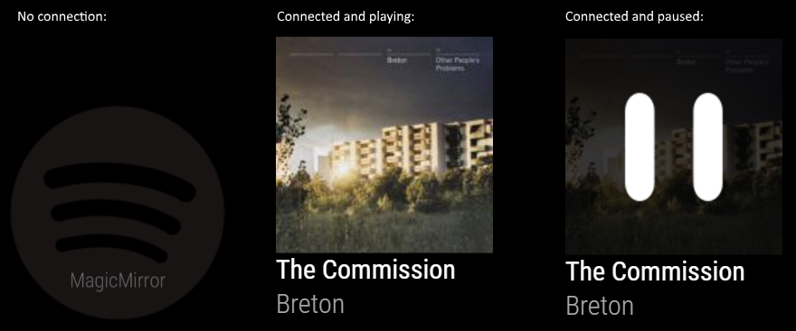

# MagicMirror Module: MMM-SpotifyConnectUI

The 'MMM-SpotifyConnectUI' module is for displaying information from Spotify Connect (running on the RPi) via [spotify-connect-web](https://github.com/Fornoth/spotify-connect-web) (prerequisite which have to be installed seperately). The module provides no interaction other than showing if connected, what song is playing or if paused. You have to start and interact using Spotify on PC or mobile.

Current version is 1.0.2. See [changelog](CHANGELOG.md "Version history") for version history.

## Prerequisites
You need to have Spotify-Connect-Web installed, a **Spotify Premium subscription** and a Spotify Connect API-key for this module to work.

Note:
It seems that Spotify changed how they give out keys. You have fill out out an [application](https://developer.spotify.com/technologies/libspotify/application-keys/) and tell it's for private use. More info at Spotify Connect Web issue [#104](https://github.com/Fornoth/spotify-connect-web/issues/104). 

Detailed instructions you find [here](https://github.com/Fornoth/spotify-connect-web/blob/0.0.3-alpha/README.md).

I you are too lazy to read it all or you don't want to run it under Docker, I've summarized the steps below.
### Installing Spotify-Connect-Web
    # cd ~
    # wget https://github.com/Fornoth/spotify-connect-web/releases/download/0.0.3-alpha/spotify-connect-web_0.0.3-alpha.tar.gz   
    # tar zxvf spotify-connect-web_0.0.3-alpha.tar.gz

You will find a new folder: ~/spotify-connect-web.

Now you need to register as developer at Spotify (free!) to be able to [register](https://developer.spotify.com/) and [download](https://developer.spotify.com/technologies/libspotify/application-keys) a '**spotify_appkey.key**'. This file should be placed in the ~/spotify-connect-web folder.

### Running Spotify-Connect-Web as service
Start a new SSH terminal and create a new script-file:

    # nano ~/spotify-connect-web/spotifyconnect.sh

The content of this file should be something along this:

    #!/bin/bash
    cd /home/pi/spotify-connect-web
    ./spotify-connect-web -n MAGICMIRROR -o plughw:CARD=ALSA,DEV=1

-n is for the name Spotify Connect will broadcast itself as.
-o Is for the output device. I'm using HDMI. It might or might not work for you. Go Google! ;-)

Remember to set permissions:

    # sudo chmod a+x ~/spotify-connect-web/spotifyconnect.sh

Next you need to create the service-file, by running:

    # sudo nano /etc/systemd/system/spotifyconnect.service

The content of this file should be something along this:

    [Unit]
    Description=Spotify Connect
    After=network-online.target
    [Service]
    Type=idle
    User=pi
    ExecStartPre=/bin/sleep 25
    ExecStart=/home/pi/spotify-connect-web/spotifyconnect.sh
    Restart=always
    RestartSec=10
    StartLimitInterval=30
    StartLimitBurst=20
    [Install]
    WantedBy=multi-user.target

Remember to set permissions:

    # sudo chmod a+x /etc/systemd/system/spotifyconnect.service

Now it's time to enable and start the service:

    # sudo systemctl daemon-reload
    # sudo systemctl enable spotifyconnect.service
    # sudo systemctl start spotifyconnect.service

If you need to see status, you can run:

    # sudo systemctl status spotifyconnect.service

#Installation of the module

In your terminal, go to your MagicMirror's Module folder:

    # cd ~/MagicMirror/modules

Clone this repository:

    # git clone https://github.com/CatoAntonsen/MMM-SpotifyConnectUI.git

Configure the module in your config.js file.
## Using the module
To use this module, add it to the modules array in the `config/config.js` file:

    modules: [
    	{
    		module: 'MMM-SpotifyConnectUI',
    		position: 'fullscreen_below',
    		config: {
    			// No further configuration needed unless you run another version of spotify-connect-web on another box.
				// See MMM-SpotifyConnectUI.js for these settings.
    		}
    	}
    ]

## Configuration options

At the moment there is no need to change any of these properties - unless you run Spotify-Connect-Web on another box:

<table width="100%">
	<thead>
		<tr>
			<th>Option</th>
			<th width="100%">Description</th>
		</tr>
	<thead>
	<tbody>
		<tr>
			<td><code>Protocol</code></td>
			<td>What protocol SCW uses. 
				 <b>Default value:</b> <code>'http'</code>
			</td>
		</tr>
		<tr>
			<td><code>Host</code></td>
			<td>What hostname SCW is available on. 
				 <b>Default value:</b> <code>'localhost'</code>
			</td>
		</tr>
		<tr>
			<td><code>Port</code></td>
			<td>What port SCW uses. 
				 <b>Default value:</b> <code>'4000'</code>
			</td>
		</tr>
		<tr>
			<td><code>RemoteName</code></td>
			<td>What API SCW uses for getting the name this unit will broadcast itself as. 
				 <b>Default value:</b> <code>'/api/info/display_name'</code>
			</td>
		</tr>
		<tr>
			<td><code>MetadataApi</code></td>
			<td>What API SCW uses for getting metadata of current playing song. 
				 <b>Default value:</b> <code>'/api/info/metadata'</code>
			</td>
		</tr>
		<tr>
			<td><code>StatusApi</code></td>
			<td>What API SCW uses for getting status of the Spotify Connection state. 
				 <b>Default value:</b> <code>'/api/info/status'</code>
			</td>
		</tr>
		<tr>
			<td><code>ImageUrlApi</code></td>
			<td>What API SCW uses for getting the correct cover photo image url. 
				 <b>Default value:</b> <code>'/api/info/image_url/'</code>
			</td>
		</tr>
	</tbody>
</table>

## Credits
- Fornoth for making [spotify-connect-web](https://github.com/Fornoth/spotify-connect-web "Link to spotify-connect-web on GitHub") that this module relies on  
- Instructions for running spotify-web-connect as service: https://discourse.osmc.tv/t/howto-setup-a-spotify-connect-web-server-on-a-raspberry-pi-with-osmc/15818
- Spotify icon by Spotify
- Pause Icon made by [Freepik](http://www.flaticon.com/authors/freepik) from www.flaticon.com 
